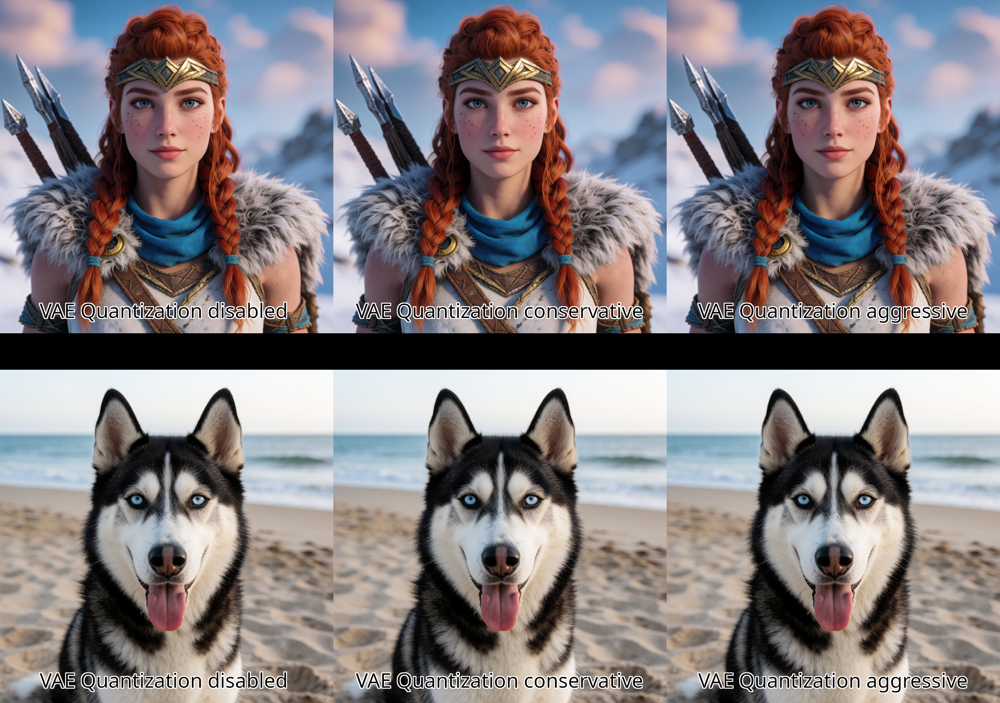

# ComfyUI-Qwen-VAE-Triton

> [!IMPORTANT]
> **Triton must be available and enabled for this node.** This project accelerates selected Qwen-Image/Wan VAE decoder `CausalConv3d` layers with custom Triton W8A8 implicit-GEMM kernels. GPU-specific environment tuning can materially affect performance, so configure your environment for your actual GPU rather than blindly copying another architecture's settings.
>
> The primary use case is reducing the unusually expensive **first workflow run** and **runs immediately after changing image resolution**. Benchmark results are shown first below; Triton enablement and GPU environment-variable guidance are provided immediately after the example image.

**Release:** `v0.2.0`

The release uses the validated mixed-precision Aggressive policy established during pre-release testing and exposes a deliberately minimal interface: **Preset + disable toggle only**.

---

## Benchmarks

Benchmark source: [`benchmarks/benchmarks.csv`](benchmarks/benchmarks.csv)

Test workflow recorded in the CSV:

- UNet: `krea2_turbo_int8_convrot.safetensors`
- CLIP: `qwen3vl_4b_bf16.safetensors`
- VAE: `qwen_image_vae.safetensors`
- 8 steps
- seed 208
- Triton enabled
- Text-to-Image

### First workflow run — 1024×1024

The first-run measurements are CSV rows 2–5. The unpatched VAE took **257.675 seconds** in the measured VAE load/decode phase and **343 seconds** for the complete workflow.

| Preset | VAE phase | VAE reduction | VAE speedup | Workflow | Workflow saved | End-to-end gain |
|---|---:|---:|---:|---:|---:|---:|
| Node bypassed | 257.675 s | — | 1.00× | 343 s | — | — |
| Conservative | 240.153 s | 6.8% | 1.07× | 327 s | 16 s | 4.7% |
| Balanced | 216.396 s | 16.0% | 1.19× | 301 s | 42 s | 12.2% |
| **Aggressive** | **208.415 s** | **19.1%** | **1.24×** | **291 s** | **52 s** | **15.2%** |

**Headline:** Aggressive removed **52 seconds** from the first 1024×1024 workflow run while cutting the measured VAE phase by **49.260 seconds**.

```text
343 s → 291 s total workflow
257.675 s → 208.415 s VAE phase
52 seconds saved end-to-end
15.2% faster workflow
19.1% lower measured VAE time
```

### Resolution-change run — 1024×1024 → 840×1256

The resolution-change sequence spans CSV rows 5–9. Row 5 is the 1024×1024 Aggressive run immediately before the changed-resolution block; rows 6–9 record the 840×1256 runs.

At 840×1256, the bypassed node required **222.573 seconds** in the measured VAE phase and **263 seconds** for the workflow. Balanced and Aggressive both completed the full workflow in **220 seconds**.

| Preset | VAE phase | VAE reduction vs bypass | VAE speedup | Workflow | Workflow saved | End-to-end gain |
|---|---:|---:|---:|---:|---:|---:|
| Node bypassed | 222.573 s | — | 1.00× | 263 s | — | — |
| Conservative | 201.960 s | 9.3% | 1.10× | 242 s | 21 s | 8.0% |
| Balanced | 179.776 s | 19.2% | 1.24× | **220 s** | **43 s** | **16.35%** |
| **Aggressive** | **179.447 s** | **19.38%** | **1.24×** | **220 s** | **43 s** | **16.35%** |

**Headline:** after the resolution change, Aggressive reduced the measured VAE phase by **43.126 seconds**, while both Balanced and Aggressive removed **43 seconds** from total workflow execution.

```text
263 s → 220 s total workflow
222.573 s → 179.447 s VAE phase (Aggressive)
43 seconds saved end-to-end
16.35% faster workflow
19.38% lower measured VAE time
```

Balanced essentially matched Aggressive at the changed resolution while preserving more native-precision decoder layers. That is why the node exposes all three presets: users can select the quality/performance point that best matches their workflow.

These are measured results from the supplied benchmark workflow, not a guarantee of identical gains on every GPU, resolution, model, driver, or ComfyUI build.

---

## Example output



### Example workflow

An importable ComfyUI workflow is included at:

```text
workflows/example_workflow.json
```

Drag the JSON file into ComfyUI or use **Workflow → Open**. The workflow demonstrates the node connected between the normal VAE loader and `VAEDecode`, with the Aggressive preset selected. Model filenames and optional third-party nodes in the example may need to be adjusted for your installation.

---

## Installation and GPU setup

### 1. Install the custom node

Place this repository under your ComfyUI `custom_nodes` directory so that the package root looks like:

```text
ComfyUI/custom_nodes/ComfyUI-Qwen-VAE-Triton/
├── __init__.py
├── nodes.py
├── selection.py
├── triton_w8a8.py
└── README.md
```

Restart ComfyUI after installation.

Clone directly from GitHub:

```bash
cd ~/ComfyUI-Docker/rocm7/storage-nodes/custom_nodes
sudo git clone https://github.com/AllenCraigBarnard/ComfyUI-Qwen-VAE-Triton.git
sudo docker restart comfyui-rocm7
```

For the ROCm7 Docker layout used during development, a release ZIP can be installed from the Docker host with:

```bash
sudo rm -rf ~/ComfyUI-Docker/rocm7/storage-nodes/custom_nodes/ComfyUI-Qwen-VAE-Triton
sudo mkdir -p ~/ComfyUI-Docker/rocm7/storage-nodes/custom_nodes/ComfyUI-Qwen-VAE-Triton
sudo unzip -q ~/Downloads/ComfyUI-Qwen-VAE-Triton-v0.2.0.zip \
  -d ~/ComfyUI-Docker/rocm7/storage-nodes/custom_nodes/ComfyUI-Qwen-VAE-Triton
sudo docker restart comfyui-rocm7
```

### 2. Enable Triton in ComfyUI

Start ComfyUI with:

```text
--enable-triton-backend
```

For example:

```bash
python main.py --listen 0.0.0.0 --port 8188 --enable-triton-backend
```

If your Docker setup passes ComfyUI arguments through an environment variable, include the same flag in that variable, for example:

```dotenv
CLI_ARGS=--enable-triton-backend
```

A healthy startup should show Triton being detected/enabled. You can also verify the runtime from inside the ComfyUI environment:

```bash
python - <<'PYVERIFY'
import torch
import triton

print("PyTorch:", torch.__version__)
print("ROCm/HIP:", torch.version.hip)
print("Triton:", triton.__version__)
print("GPU:", torch.cuda.get_device_name(0))
PYVERIFY
```

> Do not blindly replace a ROCm environment's working Triton build with an arbitrary PyPI wheel. Use the Triton build appropriate to your PyTorch/ROCm stack.

### 3. Investigate environment variables for your GPU

GPU tuning is architecture-specific. Before copying tuning values:

1. Identify the actual GPU architecture reported by ROCm/PyTorch.
2. Check the ROCm documentation for that architecture and ROCm release.
3. Check PyTorch ROCm allocator/TunableOp guidance for your installed PyTorch version.
4. Change one group of settings at a time and benchmark the same workflow before and after.
5. Remove settings that do not measurably help or that destabilize other workloads.

Useful identification commands include:

```bash
rocminfo | grep -m1 -E 'Name:.*gfx'
```

and:

```bash
python - <<'PYGPU'
import torch
print(torch.cuda.get_device_name(0))
print("HIP:", torch.version.hip)
PYGPU
```

### Strix Halo working example

The following is a **working example for the tested Strix Halo / gfx1151 environment**. It is not a universal AMD configuration:

```dotenv
HSA_OVERRIDE_GFX_VERSION=11.5.1
HIP_VISIBLE_DEVICES=0
PYTORCH_TUNABLEOP_ENABLED=1
PYTORCH_TUNABLEOP_TUNING=1
PYTORCH_TUNABLEOP_VERBOSE=1
PYTORCH_ALLOC_CONF=expandable_segments:True,garbage_collection_threshold:0.9,max_split_size_mb:512
```

If using Docker Compose, pass the variables into the ComfyUI service from your `.env` file rather than hard-coding them into the image. Example:

```yaml
environment:
  HSA_OVERRIDE_GFX_VERSION: ${HSA_OVERRIDE_GFX_VERSION}
  HIP_VISIBLE_DEVICES: ${HIP_VISIBLE_DEVICES}
  PYTORCH_TUNABLEOP_ENABLED: ${PYTORCH_TUNABLEOP_ENABLED}
  PYTORCH_TUNABLEOP_TUNING: ${PYTORCH_TUNABLEOP_TUNING}
  PYTORCH_TUNABLEOP_VERBOSE: ${PYTORCH_TUNABLEOP_VERBOSE}
  PYTORCH_ALLOC_CONF: ${PYTORCH_ALLOC_CONF}
```

`HSA_OVERRIDE_GFX_VERSION` is particularly architecture-specific. Do not copy `11.5.1` to an unrelated GPU simply because it appears in this README.

### 4. Workflow integration

Use the node between the normal VAE loader and decoder:

```text
VAELoader
   │
   ▼
Patch Qwen VAE Triton W8A8
   │
   ▼
VAEDecode
```

The node outputs a normal ComfyUI `VAE`, so no custom decode node is required.

The UI intentionally exposes only:

```text
Preset
Disable Node
```

Enable `disable_node` to pass the VAE through unchanged for A/B benchmarking.

---

## Presets

All presets use the same fixed W8A8 implementation:

```text
Weights:     symmetric INT8, per-output-channel scaling
Activations: dynamic symmetric INT8
Compute:     INT8 × INT8 with INT32 accumulation
Rescale:     FP32
Output:      incoming activation dtype
```

Internal production settings are fixed in this release:

```text
activation clip ratio = 1.0
weight clip ratio     = 1.0
channels_last         = enabled
fallback_on_error     = enabled
per-layer profiling   = disabled
```

### Conservative

Quantizes only the **highest eligible decoder channel tier**.

For the tested Qwen Image VAE topology this corresponds to the deepest 384-channel tier and patches approximately **15 of 28 eligible Conv3D layers**.

Use this when quality conservatism matters more than maximum first-run acceleration.

### Balanced

Quantizes the **highest two eligible decoder channel tiers**.

For the tested Qwen Image VAE topology this patches approximately **22 of 28 eligible Conv3D layers**, leaving the lowest 96-channel tier native.

Balanced delivered a strong performance/precision compromise in testing and matched Aggressive's **220-second** end-to-end time after the tested resolution change.

### Aggressive

Quantizes every eligible decoder channel tier **except the two U14 layers proven to introduce unacceptable noise when quantized**.

These remain in native precision:

```text
decoder.upsamples.14.residual.2
decoder.upsamples.14.residual.6
```

The built-in exclusion is:

```regex
^decoder\.upsamples\.14\.residual\.(2|6)$
```

On the tested Qwen Image topology this yields approximately **26 W8A8 layers and 2 native eligible layers**.

Aggressive produced the fastest first-run result in the supplied benchmark while preserving the validated U14 quality fix.

---

## License and attribution

This project is distributed under the **GNU General Public License v3.0 only (GPL-3.0-only)**. See [`LICENSE`](LICENSE).

The design and portions of the implementation were informed by the GPL-3.0 licensed [`kijai/ComfyUI-KJNodes`](https://github.com/kijai/ComfyUI-KJNodes) `Patch Triton VAE` implementation, particularly its INT8 implicit-GEMM Conv3D strategy, Qwen/Wan causal-convolution handling, and ComfyUI object-patcher integration. See [`NOTICE.md`](NOTICE.md) for attribution details.

This repository is an independent project and is not endorsed by Krea, Qwen/Alibaba, ComfyUI, AMD, or the KJNodes author.

---

## Work with me / More projects

If this repository saved you some VRAM, debugging time, or helped make a demanding AI workflow more practical, there is a lot more where this came from.

I’m currently looking for **full-time opportunities as an AI Systems Engineer**, particularly work involving model optimization, inference systems, GPU acceleration, quantization, generative AI infrastructure, and the engineering needed to make large models run reliably in real-world environments. If your team is hiring and this kind of work is relevant, please reach out to me on **[LinkedIn](https://www.linkedin.com/in/allen-b-3a35505a/)**.

Want to see more of what I build? Visit **[PuppetVisionAI on YouTube](https://www.youtube.com/@PuppetVisionAI)** for more projects, experiments, and practical AI systems work, or visit **[puppetvision.nl](https://puppetvision.nl)** for my website.

---

## Disclaimer

This software is provided **as-is**, without warranty of any kind. GPU kernels, quantization, ROCm/Triton configuration, environment overrides, custom nodes, and model-runtime modifications can cause crashes, incorrect output, instability, corrupted workflows, or data loss when used incorrectly or in unsupported environments.

You are responsible for validating compatibility with your own hardware, drivers, models, workflows, and data. Keep backups of important workflows, models, configuration files, and output before testing custom or experimental GPU software. Do not use benchmark or environment settings from this repository as a substitute for checking the requirements of your own GPU and software stack.

To the maximum extent permitted by applicable law, the authors and contributors are not responsible for misuse, loss of data, lost work, hardware or software damage, business interruption, loss of profits, or other direct or indirect damages arising from use of this software. The GPL-3.0 license also contains the project's formal no-warranty and limitation-of-liability terms.
